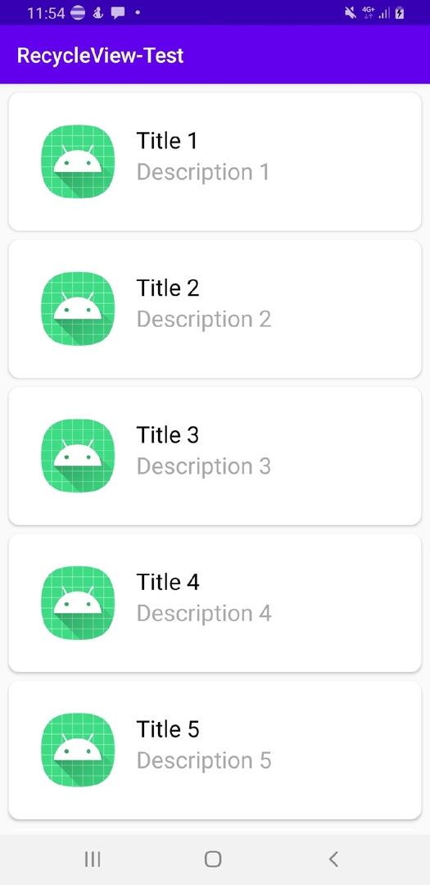
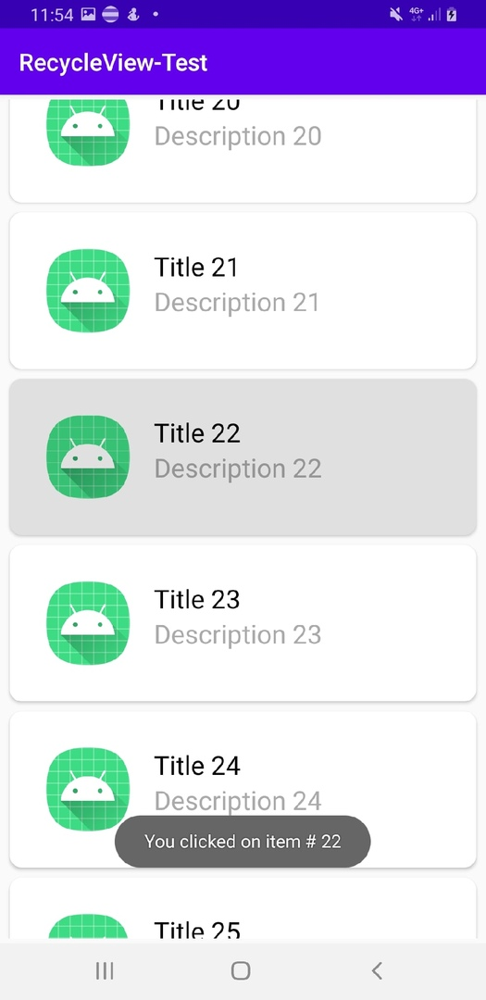

# RecycleView-Test-Android
Android project with only recycleView

# What can it  do?
  - Displays RecycleView with 25 items added by FOR loop
  - Makes toast when you click the item

# What I learnt?
  - RecycleView basics(Adapter, item layout, adding items)

# Screenshots

  
  

# Credits

Thanks <a href="https://www.youtube.com/channel/UCuudpdbKmQWq2PPzYgVCWlA">Code Palace</a> for <a href="https://www.youtube.com/watch?v=ai9rSGcDhyQ">understandable video</a>

**hello world:)**
